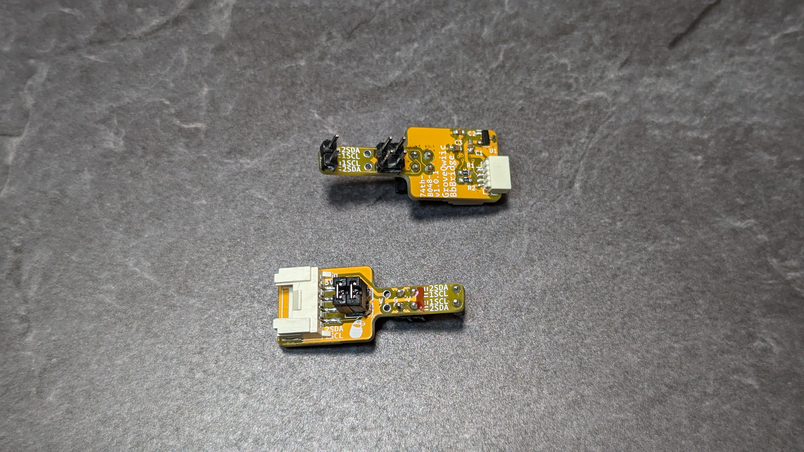
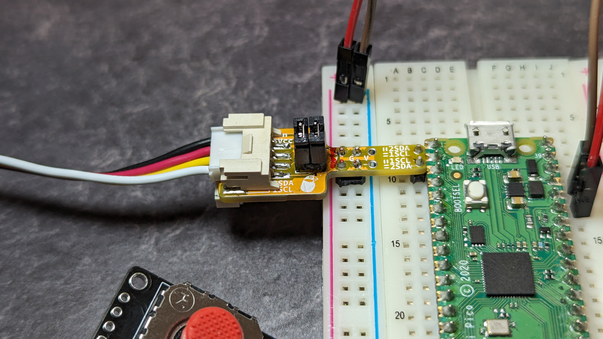
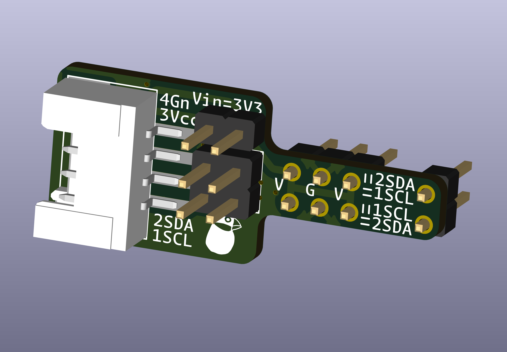
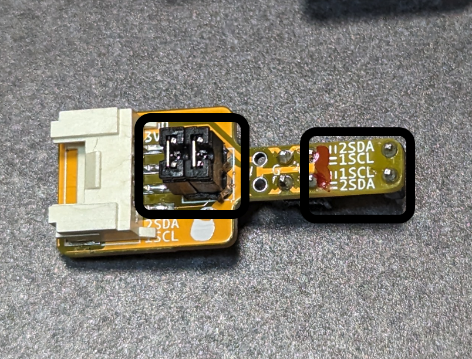

# ブレッドボードで Grove、Qwiic を扱う為のアダプタ

ブレッドボードの VCC、GND 列と、ピンを Grove、Qwiic に繋げるアダプタです。

BOOTH 販売サイト: https://74th.booth.pm/items/5831264

## feature

- Grove と Qwiic の両対応
- 3.3V のプルアップ回路付き
- ブレッドボードの電源用ピンを使って、最小サイズ
- Grove の VCC はブレッドボードの電源ピンに直接接続

## Photo

 

 

## 使い方

ブレッドボードの電源ピンにさして利用してください。ブレッドボードのプラス電源ピンは、5V か 3.3V を、マイナス電源ピンは GND にさして利用してください。プラス電源ピンの電圧がそのまま Grove、Qwiic の 3 ピンの VCC と、4 ピンの GND にかかります。Grove デバイスに合わせて、5V、3.3V を調整してください。

ジャンパをさして、D1/SCL の 1 ピン、D2/SDA の 2 ピンに繋ぐピンを選択します。2 つのジャンパを差し込む方向で設定します。PCB 中の表記を見て差し込んでください。以下写真の「||」の形に差し込んだ状態では、上のピンが D2/SDA、下のピンが D1/SCL に繋がります。

「＝」の形に差し込むことで、上のピンを D1/SCL、下のピンが D2/SDA に繋げることができます。

## 実装上の注意

ブレッドボードの電源用に 2x3 ピンの穴が空いています。これはブレッドボードの左右で使い分けるために、2x2 ピンのみ実装します。左右のブレッドボードに合わせて、GND と VCC 1 組をまたぐように 2x2 ピンヘッダを実装してください。

アダプタを実装すると、ブレッドボードの左右どちらか専用のアダプタになります。本商品は 2 個セットで販売しております。左右のブレッドボードそれぞれのものを作ることを想定しております。誤った方に差し込むと、GND と VCC が逆になる非常に危険な状態になりますので、くれぐれもそうならないように気をつけてください。VCC の横には、ブレッドボードの電源ラインを示す赤い線と同じように、赤いマジックペンで線を引いておくと、ブレッドボードの左右を見分けやすくなります。

Qwiic ソケットは、1.0mm ピッチのそれなりに実装の難しいソケットです。Grove しか利用しないのであれば、無理に実装にトライせず、未実装にしても良いと思います。

R1、R2、U1 は、I2C 向けの 3.3V プルアップのための部品です。GPIO として使うなど、プルアップを利用しない場合には、未実装にしてください。

## v1.0.1

### BOM

- Semantics: [PDF](./grove_qwiic_breadboard_bridge-v1.0.1-semantics.pdf) [Kicanvas](https://kicanvas.org/?github=https%3A%2F%2Fgithub.com%2F74th%2F74th-open-source-hardware-projects%2Fblob%2Fmain%2Fgrove_qwiic_breadboard_bridge%2Fgrove_qwiic_breadboard_bridge.kicad_sch)
- PCB: [Kicanvas](https://kicanvas.org/?github=https%3A%2F%2Fgithub.com%2F74th%2F74th-open-source-hardware-projects%2Fblob%2Fmain%2Fgrove_qwiic_breadboard_bridge%2Fgrove_qwiic_breadboard_bridge.kicad_pcb)

| Reference | Name                                  | Quantity |
| --------- | ------------------------------------- | -------- |
| C1,C2     | Capacitor 0603 0.1uF                  | 2        |
| C3        | Capacitor 0603 10uF                   | 1        |
| CH4       | HY2.0 Socket SMD 4Pin (Grove) - Grove | 1        |
| CH6       | SH1.0 Socket SMD 4Pin (Qwiic) - Qwiic | 1        |
| R1,R2     | Register 0603 1kΩ                     | 2        |
| U1        | Regulator 3.3V SOT-23 AP7333-33SAG    | 1        |

- SDA、SCL のプルアップが不要な場合、R1、R2、U1 を未実装にしてください。
