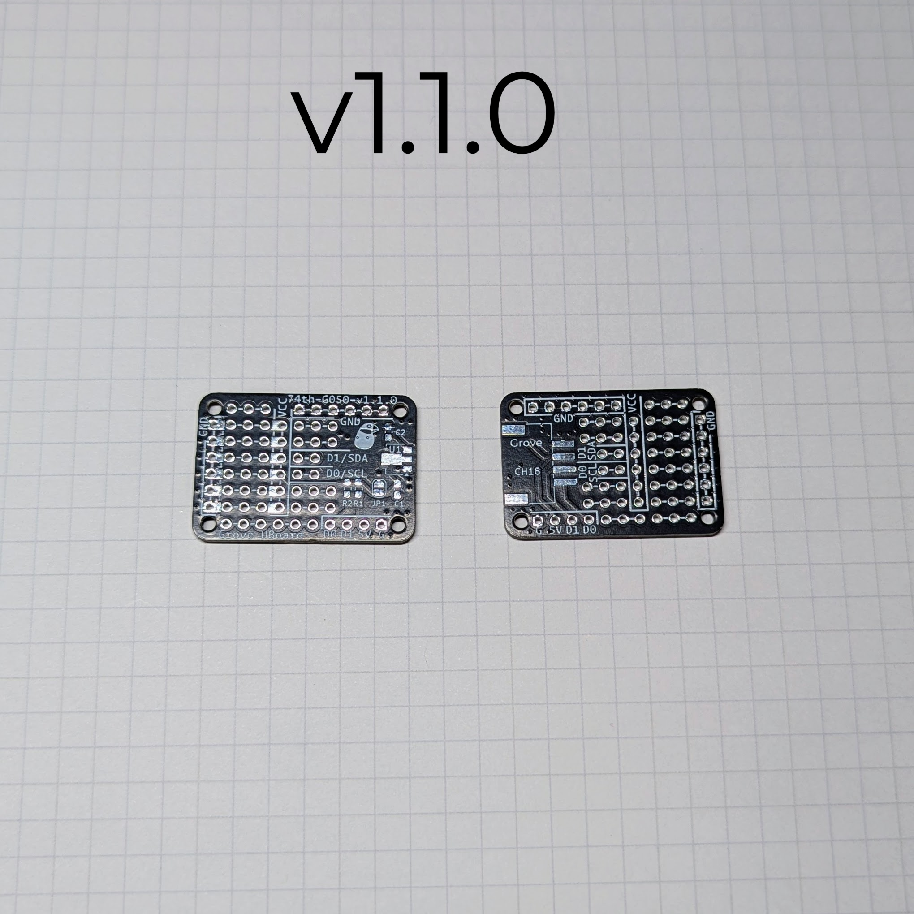
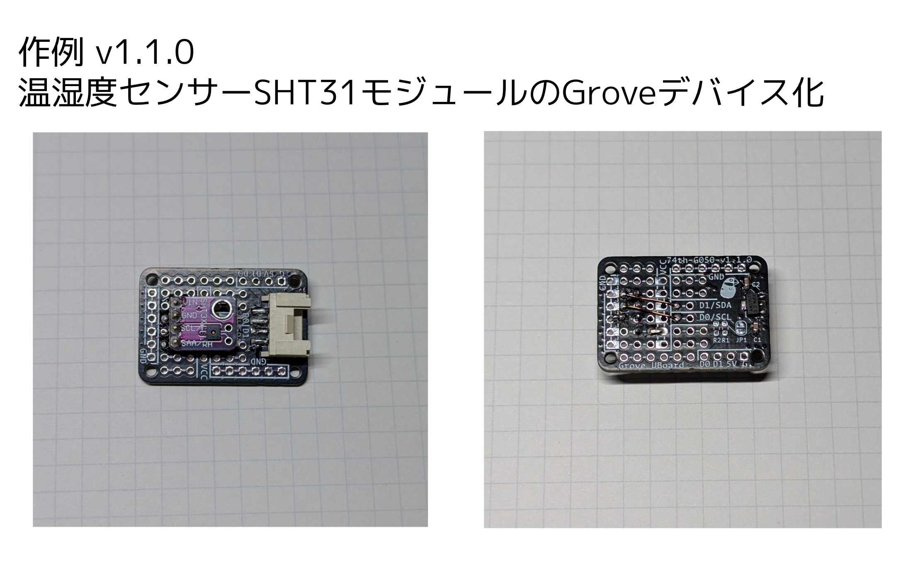
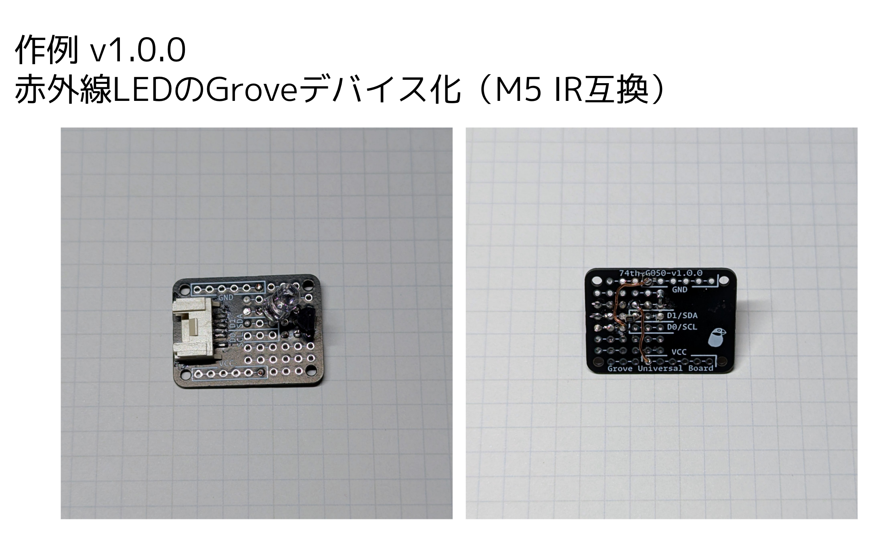

# Grove デバイスを作るためのユニバーサル基板

Shop: https://74th.booth.pm/items/5935664

- semantics: [pdf](./grove_universal_board-semantics-v1.1.0.pdf) [kicanvas](https://kicanvas.org/?github=https%3A%2F%2Fgithub.com%2F74th%2F74th-open-source-hardware-projects%2Fblob%2Fgrove_universal_board%2Fv1.1.0%2Fgrove_universal_board%2Fgrove_universal_board.kicad_sch)
- pcb: [kicanvas](https://kicanvas.org/?github=https%3A%2F%2Fgithub.com%2F74th%2F74th-open-source-hardware-projects%2Fblob%2Fgrove_universal_board%2Fv1.1.0%2Fgrove_universal_board%2Fgrove_universal_board.kicad_pcb)

## feature

- Grove コネクタを搭載
- 2、3 つのスルーホールが接続された状態になっており、ワイヤーを挿入してはんだ実装することができる（通常のユニバーサル基板はワイヤー実装面でスルーホールに挿入せず、スルーホール上のランドに接続して実装する）
- 電源 5V 供給時に、3.3V を使用できるレギュレータを追加可能にする
- ジャンパ JP1 を接続すると、ユニバーサル基板上の VCC に Grove の VCC を直結させることができる
- I2C 用のプルアップ抵抗を接続可能

## 作例

## 使い方

### ユニバーサル基板としての使い方

シルクでラインで繋がれたスルーホール同士は接続しています。
ワイヤーを差し込んで配線することが可能です。
一般的なユニバーサル基板とは異なることを留意してください。

### 電源の接続方法（v1.1.0）

U1、JP1 を実装するかどうかで、

| Grove で供給される VCC | 基板上の VCC | U1      | JP1                |
| ---------------------- | ------------ | ------- | ------------------ |
| 5V                     | 5V           | 未実装  | 接続（クローズ）   |
| 5V                     | 3.3V         | 実装    | 未接続（オープン） |
| 3.3V                   | 3.3V         | 未実装※ | 接続（クローズ） ※ |

※ 若干電圧降下はあるが、U1 を実装し、JP1 をオープンでも良い。

### I2C の場合のプルアップ方法（v1.1.0）

Grove ホスト側に I2C 用のプルアップ抵抗がない場合、R1、R2 を実装することで、プルアップを行うことができます。

## v1.1.0

- 5V から 3.3V へのレギュレータを追加可能に
- I2C プルアップ抵抗を追加可能に
- VCC と GND をデバイス接続ピンの近くに配置
- Grove の各ポートにアクセスできるスルーホールを追加（ロジックアナライザ等に最適）

### BOM

| Reference | Name                                  | Quantity |
| --------- | ------------------------------------- | -------- |
| C1,C2     | Capacitor 0603 10uF(NC)               | 2        |
| CH18      | HY2.0 Socket SMD 4Pin (Grove) - Grove | 1        |
| R1,R2     | Register 0603 1kΩ(NC)                 | 2        |
| U1        | Regulator 3.3V SOT-89 AMS1117-3.3(NC) | 1        |

- C1、C2、U1 は 5V 電源供給し、3.3V を使用する場合のみ実装します
- R1、R2 は I2C 用のプルアップを追加する場合のみに実装します

## v1.0.0

Grove ポートと、3 連スルーホールだけのシンプルなバージョン。

- pcb: [kicanvas](https://kicanvas.org/?github=https%3A%2F%2Fgithub.com%2F74th%2F74th-open-source-hardware-projects%2Fblob%2Fgrove_universal_board%2Fv1.0.0%2Fgrove_universal_board%2Fgrove_universal_board.kicad_pcb)
