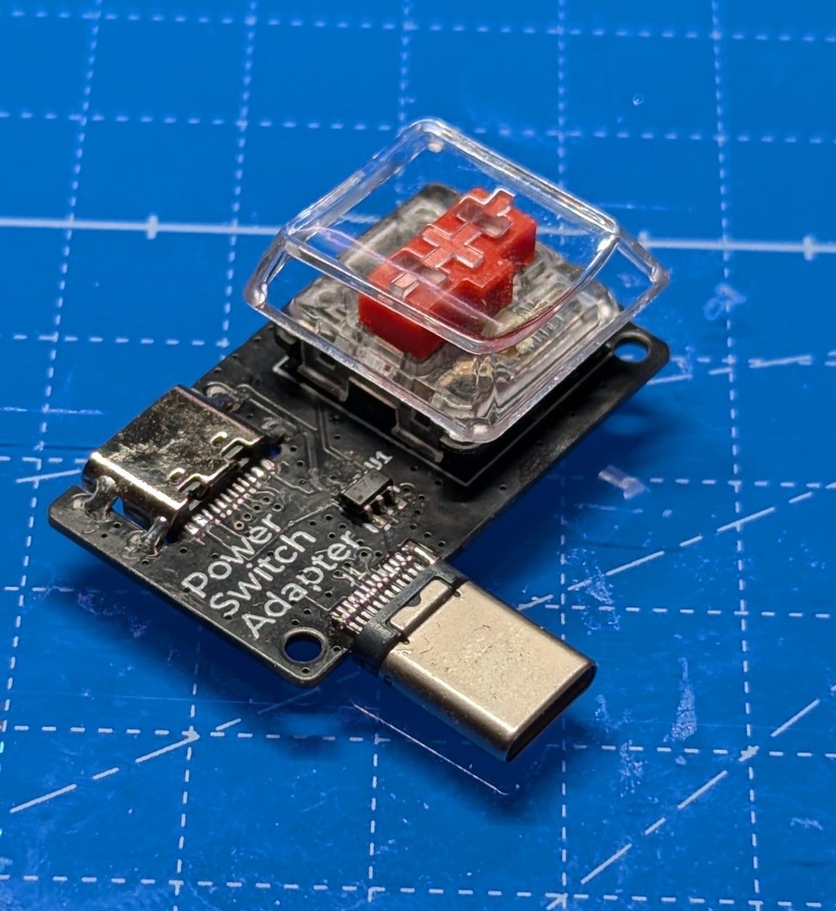

# USB Switch Adapter

Switchable adapter for 5V USB-C devices that allows power shutdown with a switch.

スイッチで、電源遮断によるオフが行える 5V USB-C デバイスのアダプタ

🎥 https://twitter.com/74th/status/1823146532520239136

## feature

- Uses CH217 as the power switch.
- Can be used with CherryMX compatible switches or Kailh Choc Switches commonly used in custom keyboards, allowing for very light key presses.
- Pressing the switch can turn off the power. Additionally, holding down the switch can maintain the power-off state.
- Functions as a resettable fuse for overcurrent protection of 2A or higher. Overcurrent is indicated by LED flashing.
- Used WCH CH32V003J4M6 as the microcontroller. Various functionalities can be added by rewriting the firmware.

### 🇯🇵

- 電源スイッチとして、CH217 を使用。
- スイッチとして、自作キーボードで使われる CherryMX 互換スイッチ、または Kailh Choc Switch を使用可能で、非常に軽い力で押せるようにもできる。
- スイッチ押下で電源断ができる。さらにスイッチ長押しで電源断の状態を継続できる。
- 2A 以上の過電流によるリセッタフューズとしても機能する（2A）。過電流自は、LED が点滅する。
- 制御マイコンとして、WCH CH32V003J4M6 を使用。ファームウェアを書き換えることで、様々な機能を追加できる。

## 1.1.0

- Semantics [PDF](./usb_switch_adapter-semantics-1.1.0.pdf) [Kicanvas](https://kicanvas.org/?github=https%3A%2F%2Fgithub.com%2F74th%2F74th-oshw-projects%2Fblob%2Fusb-switch-adapter%2F1.1.0%2Fusb_switch_adapter%2Fusb_switch_adapter.kicad_sch)
- PCB [Kicanvas](https://kicanvas.org/?github=https%3A%2F%2Fgithub.com%2F74th%2F74th-oshw-projects%2Fblob%2Fusb-switch-adapter%2F1.1.0%2Fusb_switch_adapter%2Fusb_switch_adapter.kicad_pcb)

## BOM

| Reference | Name                                             | Quantity |
| --------- | ------------------------------------------------ | -------- |
| C1        | Capacitor 0603 100nF                             | 1        |
| D1        | LED 0805 Blue                                    | 1        |
| J1        | USB Type-C Receptacle                            | 1        |
| J2        | USB Type-C Receptacle                            | 1        |
| R1        | Register 0603 56kΩ                               | 1        |
| R2        | Register 0603 10kΩ                               | 1        |
| SW1       | Cheery MX Compatible Switch or Kailh Choc Switch | 1        |
| U1        | USB Power Protection IC SOT-23-6L CH217K         | 1        |
| U2        | MCU SOIC-8 WCH CH32V003J4M6                      | 1        |

## Firmware

- [./firmware/](./firmware/) using ch32v003fun
