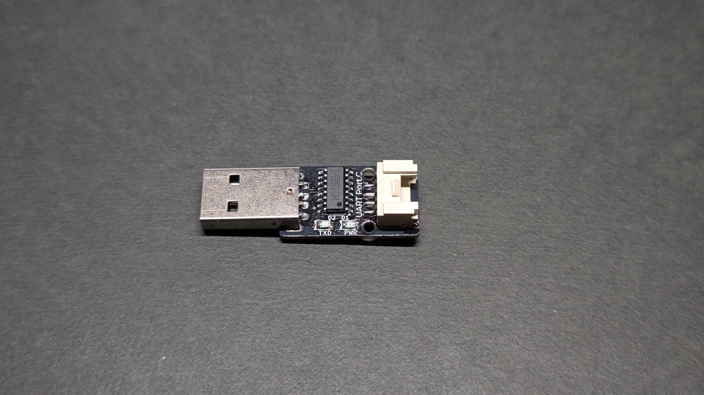
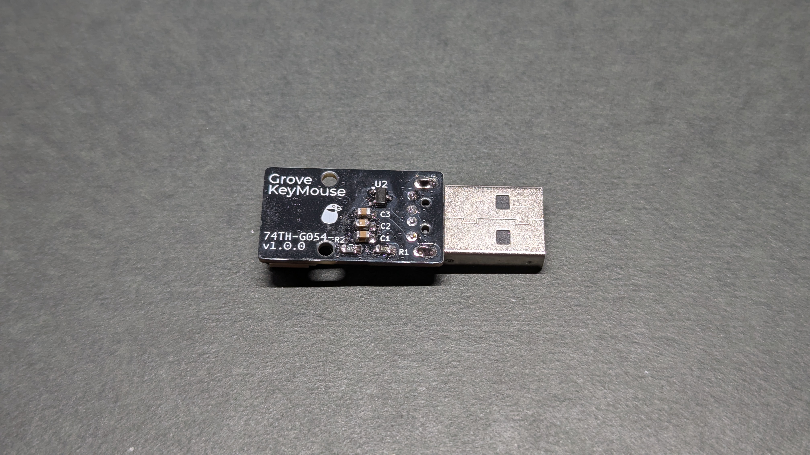
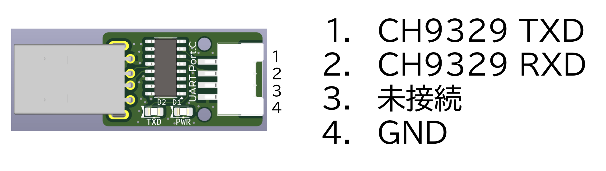

# Grove KeyMouse

USB キーボード、マウスエミュレータ CH9329 を搭載した Grove モジュールです。

PC のキーボードとマウスとして、UART で制御することができます。

私（74th）の家では、TV 横 PC に接続されており、Grove で ESP32-C3 ボードに接続されています。ESP32-C3 ボードが WebAPI として動いており、スリープ中の TV 横 PC に Enter キーを押してスリープから復帰させたり、Ctrl-W でタブを閉じるなど、スマホの WebUI からできるように組み込んだりしています。

## CH9329 とは

CH9329 とは、UART の信号で、USB キーボード、マウスをエミュレートする IC です。
キーボードの打鍵の代わりに、UART でキーコードを含んだコマンドを送信することで、USB 側でキーボードとして振る舞います。

9600 bps で以下のコマンドを送ることで、キーボードとして振る舞います。代表的なキーボードとマウスのコマンドは以下のものです。

1 度コマンドを送ると、次に送るまではそのキーボードのキー、マウスのボタンは維持されたままになります。つまりキーコードを送ると、次のコマンドを送るまでは、そのキーは押されたままの状態として扱われます。そのため、ボタンおよびキー入力を行うためには、押された状態と、離した状態（キーボードであれば、キーコード 1-6 がすべて`0x00`）の 2 回のコマンドを送る必要があります。

CH9329 の使い方は、みんなのラボさんのプロダクトの説明 https://sites.google.com/site/ichiworkspace/%E3%83%9B%E3%83%BC%E3%83%A0/%E3%81%BF%E3%82%93%E3%81%AA%E3%81%AE%E3%83%A9%E3%83%9C/%E3%82%AD%E3%83%BC%E3%83%9C%E3%83%BC%E3%83%89%E3%83%9E%E3%82%A6%E3%82%B9%E3%82%A8%E3%83%9F%E3%83%A5%E3%83%AC%E3%83%BC%E3%82%BF が詳しいです。CH9329 のデータシートを和訳したものも公開されていて、非常に参考になります。

また、拙著[『WCH の IC を活用する電子工作の本』](https://booth.pm/ja/items/5261331)でも少し解説しています。

## ピン配置

CH9329 の電源は、USB 側から供給されます。

MCU 側では 1 を RXD（CH9329→MCU）、2 を TXD （MCU→CH9329）としてください。

## v1.0.0

- 回路図: [PDF](./grove_keymouse-v1.0.0-semantics.pdf) [KiCanvas](https://kicanvas.org/?github=https%3A%2F%2Fgithub.com%2F74th%2F74th-oshw-projects%2Fblob%2Fgrove-keymouse%2F1.0.0%2F74TH-G054-grove_keymouse%2Fgrove_keymouse.kicad_sch)
- PCB: [KiCanvas](https://kicanvas.org/?github=https%3A%2F%2Fgithub.com%2F74th%2F74th-oshw-projects%2Fblob%2Fgrove-keymouse%2F1.0.0%2F74TH-G054-grove_keymouse%2Fgrove_keymouse.kicad_pcb)

### BOM

> [!Caution]
> USB-A プラグには実装面を示すシルクはありません。写真を参考に表裏を気をつけてください。Groveソケットと同じ面にプラグがくる様に実装してください。

| Reference | Name                                        | Package         | Quantity |
| --------- | ------------------------------------------- | --------------- | -------- |
| C1-2      | Capacitor 100nF                             | SMD I0805 M2012 | 2        |
| C3        | Capacitor 1uF                               | SMD I0805 M2012 | 1        |
| CH1       | HY2.0 Socket SMD 4Pin (Grove) - UART Port.C |                 | 1        |
| D1        | LED Red                                     | SMD I0805 M2012 | 1        |
| D2        | LED Blue                                    | SMD I0805 M2012 | 1        |
| J1        | USB Type-A Plug                             |                 | 1        |
| R1        | Register 10kΩ                               | SMD I0805 M2012 | 1        |
| R2        | Register 5.1kRΩ                             | SMD I0805 M2012 | 1        |
| U1        | USB Keyboard Mouse Device IC CH9329         | SOIC-16         | 1        |
| U2        | USB Power Protection IC CH213K              | SOT-23          | 1        |
