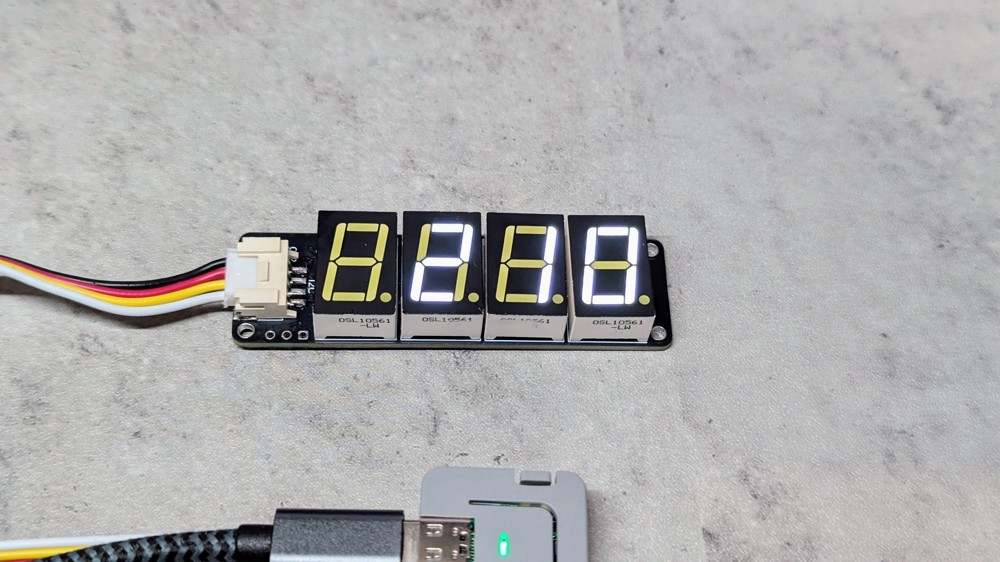
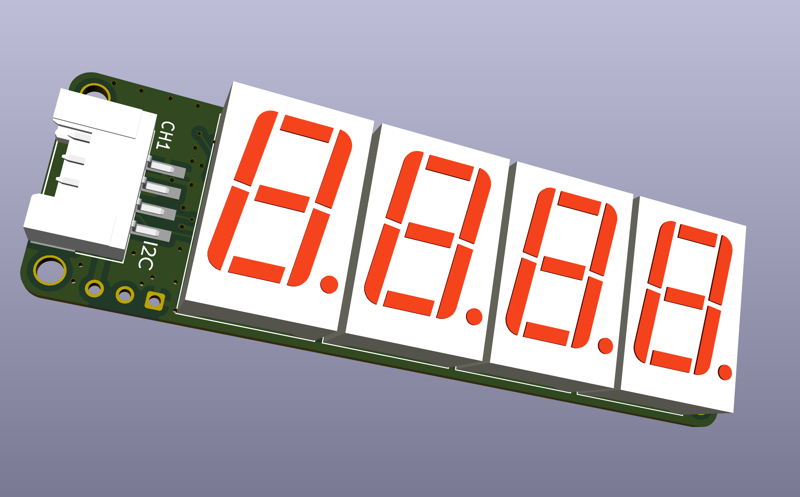
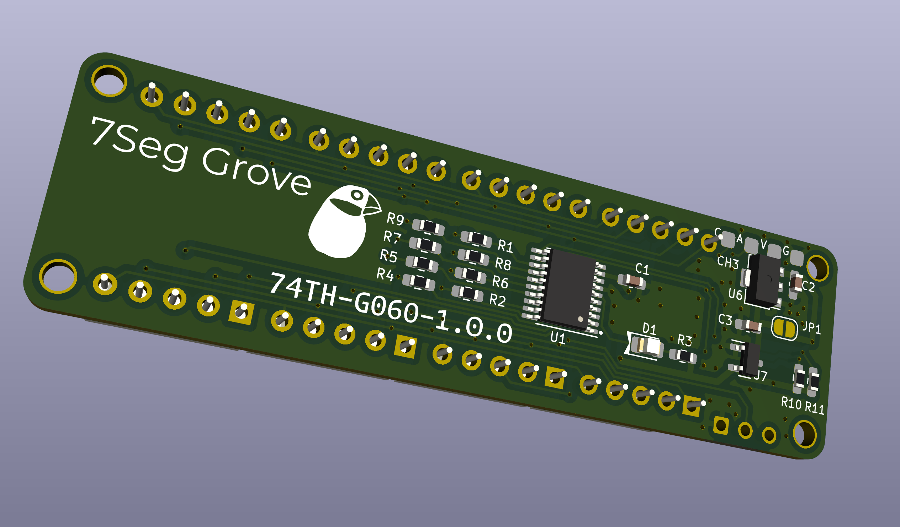

# 7Seg Grove

This module allows you to control four 7-segment LEDs using I2C signals through a Grove connector.

🇯🇵 7セグLEDをI2Cで制御するGroveモジュール

 

Movie tweet: https://x.com/74th/status/1870251968486355227

## I2C Protocol

- Address: 0x73

example: [Sample Firmware (](./sample-firmware/)

### Registers

| address |                                               | R/W | reset |
| ------- | --------------------------------------------- | --- | ----- |
| 0x00    | Direct IO for LED 1                           | R/W | 0x00  |
| 0x01    | Direct IO for LED 2                           | R/W | 0x00  |
| 0x02    | Direct IO for LED 3                           | R/W | 0x00  |
| 0x03    | Direct IO for LED 4                           | R/W | 0x00  |
| 0x10    | Number uint16 input(Upper bit)                | W   | 0x00  |
| 0x11    | Number uint16 input(lower bit)                | W   | 0x00  |
| 0x12    | Point location(0x00 is OFF) (Not Impremented) | W   | 0x00  |

#### Direct IO bits

| bit | Function              |
| --- | --------------------- |
| 1   | LED A(1: ON, 0: OFF)  |
| 2   | LED B(1: ON, 0: OFF)  |
| 3   | LED C(1: ON, 0: OFF)  |
| 4   | LED D(1: ON, 0: OFF)  |
| 5   | LED E(1: ON, 0: OFF)  |
| 6   | LED F(1: ON, 0: OFF)  |
| 7   | LED G(1: ON, 0: OFF)  |
| 8   | LED DP(1: ON, 0: OFF) |

## PCB Documents

### 1.0.0-1.0.1

- 1.0.1（未発売）: Groveソケットの位置を微調整。回路図上のピンの名前を修正。
  - semantics [PDF](semantics-1.0.1.pdf) [KiCanvas](https://kicanvas.org/?github=https%3A%2F%2Fgithub.com%2F74th%2F74th-oshw-projects%2Fblob%2F7seg-grove%2F1.0.1%2F74TH-G060-7seg-grove%2F74TH-G060-7seg-grove.kicad_sch)
  - PCB [KiCanvas](https://kicanvas.org/?github=https%3A%2F%2Fgithub.com%2F74th%2F74th-oshw-projects%2Fblob%2F7seg-grove%2F1.0.1%2F74TH-G060-7seg-grove%2F74TH-G060-7seg-grove.kicad_pcb)
- 1.0.0
  - semantics [PDF](semantics-1.0.0.pdf) [KiCanvas](https://kicanvas.org/?github=https%3A%2F%2Fgithub.com%2F74th%2F74th-oshw-projects%2Fblob%2F7seg-grove%2F1.0.0%2F74TH-G060-7seg-grove%2F74TH-G060-7seg-grove.kicad_sch)
  - PCB [KiCanvas](https://kicanvas.org/?github=https%3A%2F%2Fgithub.com%2F74th%2F74th-oshw-projects%2Fblob%2F7seg-grove%2F1.0.0%2F74TH-G060-7seg-grove%2F74TH-G060-7seg-grove.kicad_pcb)

#### BOM

- 利用したいGroveポートの電源電圧にあわせて、実装してください
  - VCCに3.3Vを流す場合: U7を未実装にし、JP1を短絡してください
  - VCCに5Vを流す場合（M5Stackなど）: U7を実装にし、JP1を未接続にしてください
- CH2 Groveソケットは、U1-4 7セグLEDより先に実装してください。7セグLEDは高さがあるため、はんだ付けが若干難しくなります。

| Reference | Name                                                 | Package         | Quantity |
| --------- | ---------------------------------------------------- | --------------- | -------- |
| C1        | Capacitor 100nF                                      | SMD I0603 M1608 | 1        |
| C2-3      | Capacitor 10uF                                       | SMD I0603 M1608 | 2        |
| CH2       | HY2.0 (Grove) or SH1.0 (Qwiic) Socket SMD 4Pin - I2C | SMD             | 1        |
| D1        | LED BLUE                                             | SMD I0805 M2012 | 1        |
| R1-8      | Register 100Ω                                        | SMD I0603 M1608 | 8        |
| R9        | Register 10kΩ                                        | SMD I0603 M1608 | 1        |
| R10-11    | Register 1kΩ                                         | SMD I0603 M1608 | 2        |
| U1-4      | 7Seg LED OSL10561-LW                                 | TH              | 4        |
| U5        | MCU WCH CH32V003F4P6                                 | TSSOP20         | 1        |
| U6        | USB Power Protection IC CH213K                       | SOT-23          | 1        |
| U7        | Regulator 3.3V AMS1117-3.3                           | SOT-89          | 1        |

## Firmware for CH32V003

using ch32v003fun.

[./firmware/](./firmware/)

🇯🇵 キットに付属のCH32V003には、既に書き込んであります

## Sample Firmware for M5Stack Atom Lite

There is a sample firmware that allows you to see this module in action. It uses M5Stack Atom Lite.

Please check [./sample-firmware/](./sample-firmware/) for how to write it.

🇯🇵 このモジュールの動きを確認できるサンプルのファームウェアがあります。 M5Stack Atom Liteを使います。

書き込み方法などは[./sample-firmware/](./sample-firmware/)を確認ください。

[./sample-firmware/](./sample-firmware/)

## only use ch32v003 firmware

Since the firmware has the following pinout, you can also just use the CH32V003F4P6 and this firmware without using this module. See the schematic for details.

🇯🇵 以下のピン配置のファームウェアとなっているため、本モジュールを使わずに、CH32V003F4P6と本ファームウェアを使うだけを使うこともできます。詳しくは回路図を見てください。

| Pin No | Pin   | Role                |
| ------ | ----- | ------------------- |
| 1      | PD4   | LED3 Cassode Common |
| 2      | PD5   | LED2 Cassode Common |
| 3      | PD6   | LED1 Cassode Common |
| 4      | NRST  | - (Internal PullUp) |
| 5      | PA1   | All LEDs SDP        |
| 6      | PA2   | I2C Indicator LED   |
| 7      | GND   | GND                 |
| 8      | PD0   | -                   |
| 9      | VDD   | 3.3V                |
| 10     | PC0   | LED4 Cassode Common |
| 11     | PC1   | I2C SDA             |
| 12     | PC2   | I2C SCL             |
| 13     | PC3   | All LEDs SB         |
| 14     | PC4   | All LEDs SA         |
| 15     | PC5   | All LEDs SF         |
| 16     | PC6   | All LEDs SG         |
| 17     | PC7   | All LEDs SE         |
| 18     | SWDIO | SWDIO               |
| 19     | PD2   | All LEDs SD         |
| 20     | PD3   | All LEDs SC         |
