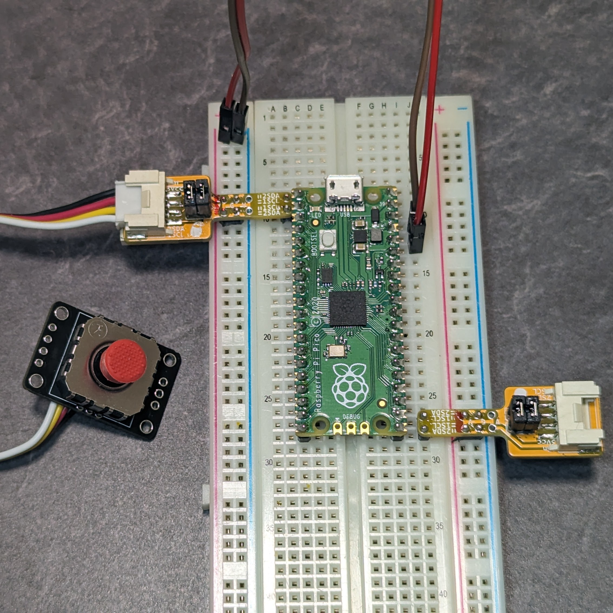
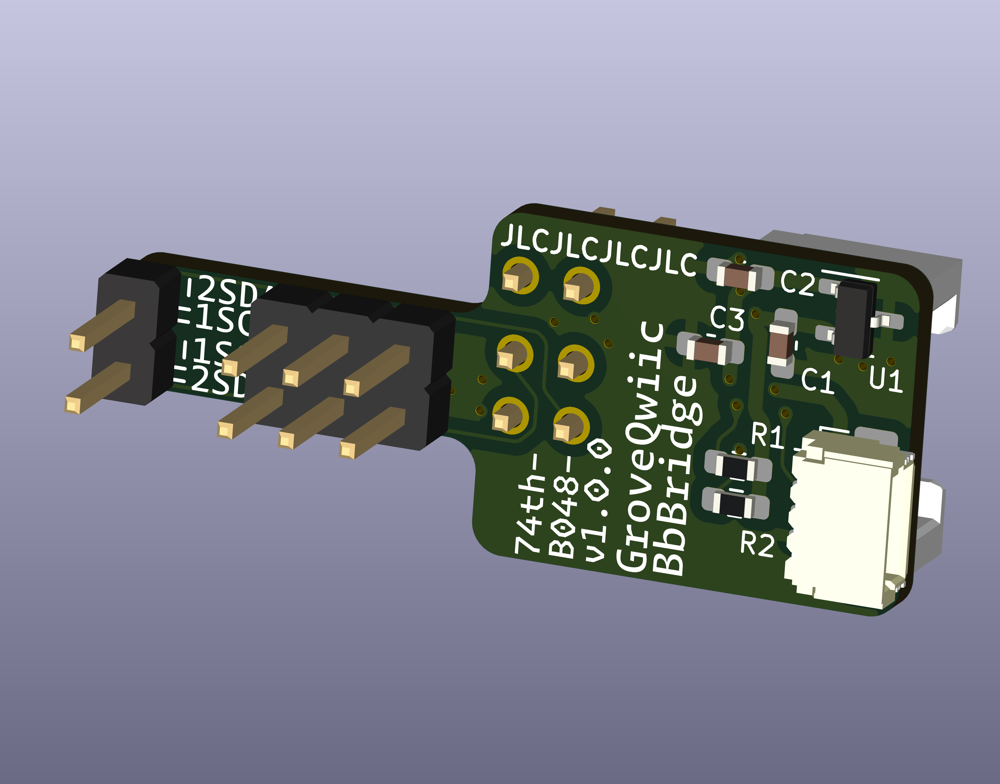

# ブレッドボードで Grove、Qwiic を扱う為のアダプタ

ブレッドボードの VCC、GND 列と、ピンを Grove、Qwiic に繋げるアダプタです。

SDA、SCL のピンは、ジャンパを接続する向きで入れ替えることができます。

SDA、SCL には 3.3V のプルアップが付いています。このプルアップは VCC に 5V を流したとしても、レギュレータで 3.3V に落とされます。

ブレッドボードでは、左右で、VCC と GND が内側と外側で入れ替わっています。実装するピンソケットを分けることで、ブレッドボードの左右を使い分けることができます。左右を間違えないように気をつけてください。組み立て後に、VCC の列に赤マジックで線を引いておくと、間違えにくくなります。

 

 

BOOTH 販売サイト: https://74th.booth.pm/items/5831264

## v1.0.1

### BOM

- Semantics: [PDF](./grove_qwiic_breadboard_bridge-v1.0.1-semantics.pdf) [Kicanvas](https://kicanvas.org/?github=https%3A%2F%2Fgithub.com%2F74th%2F74th-open-source-hardware-projects%2Fblob%2Fmain%2Fgrove_qwiic_breadboard_bridge%2Fgrove_qwiic_breadboard_bridge.kicad_sch)
- PCB: [Kicanvas](https://kicanvas.org/?github=https%3A%2F%2Fgithub.com%2F74th%2F74th-open-source-hardware-projects%2Fblob%2Fmain%2Fgrove_qwiic_breadboard_bridge%2Fgrove_qwiic_breadboard_bridge.kicad_pcb)

| Reference | Name                                  | Quantity |
| --------- | ------------------------------------- | -------- |
| C1,C2     | Capacitor 0603 0.1uF                  | 2        |
| C3        | Capacitor 0603 10uF                   | 1        |
| CH4       | HY2.0 Socket SMD 4Pin (Grove) - Grove | 1        |
| CH6       | SH1.0 Socket SMD 4Pin (Qwiic) - Qwiic | 1        |
| R1,R2     | Register 0603 1kΩ                     | 2        |
| U1        | Regulator 3.3V SOT-23 AP7333-33SAG    | 1        |

- SDA、SCL のプルアップが不要な場合、R1、R2、U1 を未実装にしてください。
