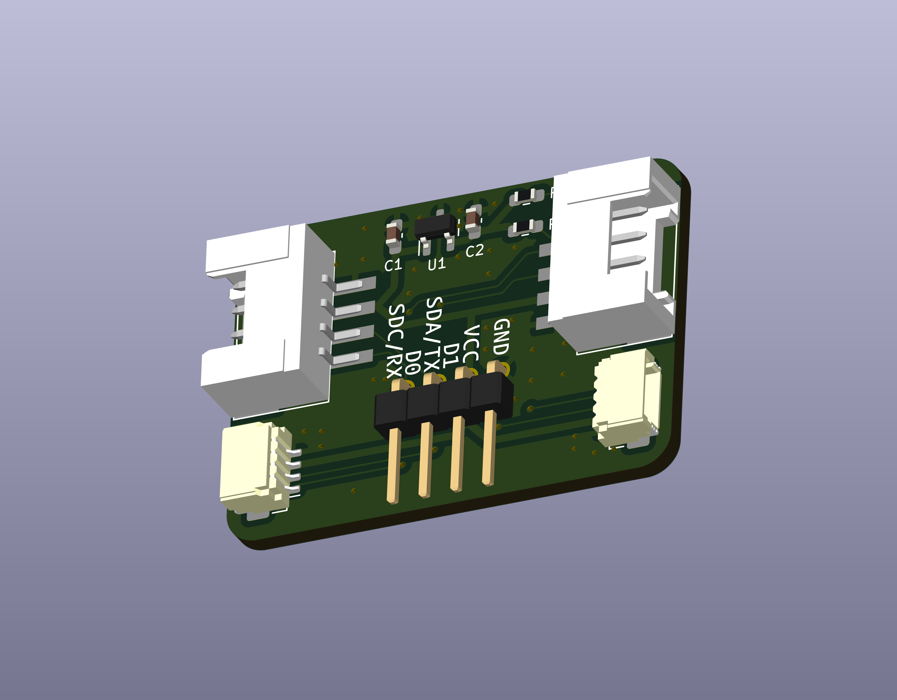

# Grove と qwiic の信号を読み取るアダプタ

- Grove と qwiic の信号を読み取るアダプタです

## v1.0.0

- semantics: [pdf](grove_qwiic_debug_adapter/grove_qwiic_debug_adapter-semantics-v1.0.0.pdf) [kicanvas](https://kicanvas.org/?github=https%3A%2F%2Fgithub.com%2F74th%2F74th-open-source-hardware-projects%2Fblob%2Fgrove_qwiic_debug_adapter%2Fv1.0.0%2Fgrove_qwiic_debug_adapter%2Fgrove_qwiic_debug_adapter.kicad_sch)
- pcb: [kicanvas](https://kicanvas.org/?github=https%3A%2F%2Fgithub.com%2F74th%2F74th-open-source-hardware-projects%2Fblob%2Fgrove_qwiic_debug_adapter%2Fv1.0.0%2Fgrove_qwiic_debug_adapter%2Fgrove_qwiic_debug_adapter.kicad_pcb)

### BOM

| Reference | Name                                  | Quantity |
| --------- | ------------------------------------- | -------- |
| CH1,CH2   | HY2.0 Socket SMD 4Pin (Grove) - Grove | 2        |
| CH4,CH5   | SH1.0 Socket SMD 4Pin (Qwiic) - Qwiic | 2        |
| C1,C2     | Capacitor 0603 100nF                  | 2        |
| R1,R2     | Register 0603 1kΩ                     | 2        |
| U1        | Regulator 3.3V SOT-23 AP7333-33SAG    | 1        |

- I2C としてプルアップが必要ない場合、C1、C2、R1、R2、U1 は不要です
