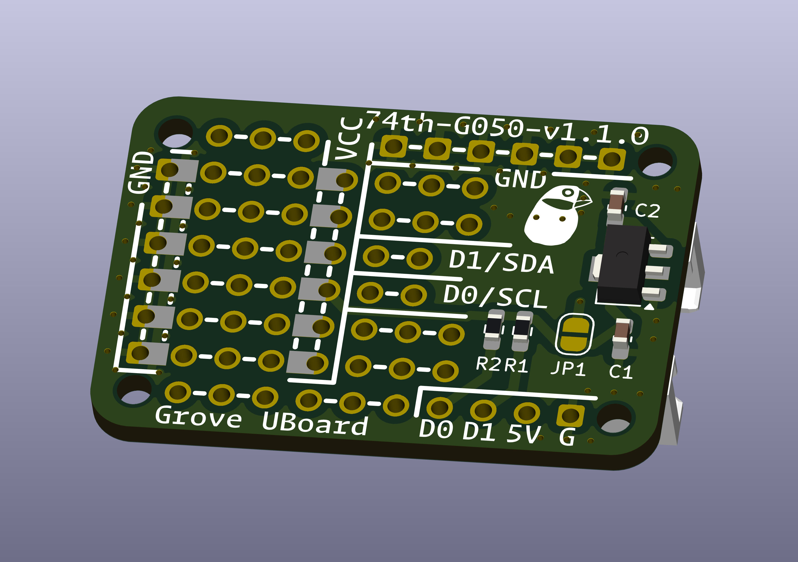

# Grove デバイスを作るためのユニバーサル基板

- pcb: [kicanvas](https://kicanvas.org/?github=https%3A%2F%2Fgithub.com%2F74th%2F74th-open-source-hardware-projects%2Fblob%2Fgrove_universal_board%2Fv1.1.0%2Fgrove_universal_board%2Fgrove_universal_board.kicad_pcb)
